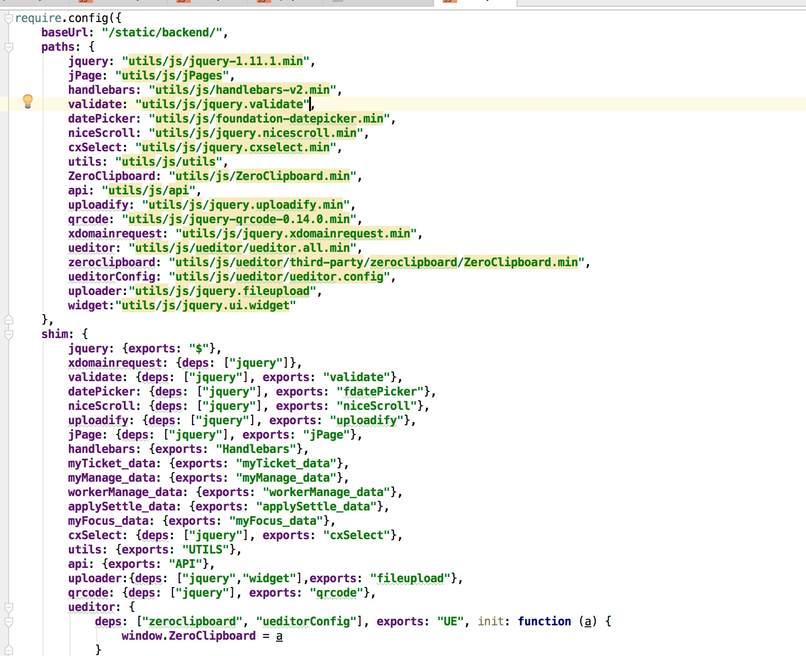

来自前端菜鸟的项目总结
===========================
项目介绍：[章鱼](http://hd.zj.qq.com/)活动平台，浙江活动优选平台。这次主要负责 pc 端用户的[后台](http://hd.zj.qq.com/user/my-home.html)页面（包括活动管理、报名人员管理、活动发布修改等一系列问题）。


### 项目基础框架
>说到这就想哭（先让我哭会）。基础框架选型的时候，本菜鸟是想找一个基础框架然后做二次开发的，然后咨询了一个同事，算大牛吧，被否决。觉得他说的很有道理，此次版本是大的版本迭代，页面定制化很强，用基础框架不一定好，然后也很难找到一个很适合的基础框架。然后技术框架，由于有很多列表渲染的情况，所以第一个想到的是用数据模版，觉得可以用vue，但是无奈我们公司要兼容到ie7，所以我觉得可以尝试用（avalon.js），但是还是被大鸟给否决了，也不太记得说了啥，反正我也就妥协了，毕竟还只是前端菜鸟。所以pc这块后台分成两波，[前台](http://hd.zj.qq.com/)部分用的是avalon.js（后悔没用），[后台](http://hd.zj.qq.com/user/my-home.html)部分用grunt、require、jquery、handlebars、jPage，这里不是说后台这种做法不好，只是后台实际情况中确实遇到各种问题。


### 项目搭建


后台部分由于是两个人协同工作，所以需要定义一些基本的规定，比如用require，用同一个[base.js](/static/backend/utils/js/base.js)(统一资源管理)，用同一个api.js(接口的统一管理)，同一个[utils.js](/static/backend/utils/js/utils.js)(自定义的插件库，loading、alert、handle回掉)

项目打包可开发环境用的是[grunt](https://github.com/yuwanli/grunt-config)(基础的简单配置)

项目中用了各种各样的插件(由于没有所谓的基础框架，就是jquery，项目纯手搭)，比如datapicker.js(日历插件)、handlebar.js(数据模版插件)、jPage.js(分页插件)、qrcode(生成二维码的插件)、jquery.cxselect(菜单联动)、一堆上传图片的插件(这块坑苦我了，最后都弃用了，图片用了最原始的表单提交)、jquery.validate(表单验证)、zeroclipboard(剪贴板插件)、ueditor(富文本编辑器)等等。你看梳理下来这么多插件，每个插件都得去查他的兼容性，然后还要做比较，这块真的花了很多时间，后悔没选一个基础框架，这样就不用这样一个个的找插件。

[自定义组件库](/static/backend/utils/js/utils.js)：这块我主要封装了三个常用的组件
    loading:加载组件（页面初始化前的loading、及数据请求时的pending）
    alertInfo:提示组件(统一的提示框，可自定义提示图标、提示标题、提示描述、提示按钮及按钮的回调)
    handle:处理接口数据组件(搭配alertInfo使用)，这块得跟后台开发人员确定一些基本的数据规则，返回的数据格式，对应的code代表什么意思


### 项目开发


1，mockData:开发过程中，往往会遇到的问题的是前后端的步调不统一，这个时候前端需要自行先本地mock数据，后期让后端人员尽量按你给定的格式返回你数据。可以采用的es6的promise来模拟异步请求，也可以利用定时器，拿到接口以后换成接口请求即可。总之，mockData是一个前端人员必备的技能，这样就不会出现开发等待的情况，也可以让前端人员更加清楚业务的数据模型。

2，列表页的请求。针对这块，我想到之前看到的一个问题，如何尽量的减少列表页的请求？列表页请求无非是一个page一个num，其实其中可以做到的数据优化有很多，以下是来自一个前端菜鸟的看法：
    列表数据变化频率不是很快的情况下，可以做数据存储，前面列表请求的数据可以存储到一个对象里，再次请求就不需要再去取，那如果列表数据变化频率较快的情况下，不宜做存储操作
    请求到数据的时候做一个判断，若请求返回的数组长度小于当前传给后端的固定num的时候，我们可以做'无更多数据'、禁加载更多按钮等关闭用户请求下一页的操作。

3，require的使用。为了方便统一的资源管理，和按需加载。这里要说的就是，由于是单页面的项目，不能每个页面都去定义资源路径和资源的依赖关系，所以这里做了一个公用的资源管理文件。

    ```javascript
    require(["../utils/js/base"],function (base) {
        require(['jquery'], function ($) {
            //your code
        })
    })
    ```

### 关于这个项目，我有话说

说实话，这个项目个人觉得做的挺失败的，管理一个项目的时候才发现自己欠缺的东西还有很多，毕竟还只是菜鸟一枚。

项目初期，尽可能去规划项目（公共文件，基本规则制定等），但是到项目后期发现很吃力，还是眼界太小了。

初期根本就没考虑到一个上线和后期的迭代的一个问题，因为整个项目涉及到的文件越来越多，维护成本越来越高（这也就是后悔没用avalon.js的原因，一键打包一键上传），迭代的复杂度也高，而且html最终线上是php文件，导致调试也不方便，如今测试人员跟我说有bug要修复或者产品来提需求要迭代功能的时候，我就想！屎!

这里，只是为了分享一下项目的经验，现在处于仍需不断大量学习的阶段，这里记录一下一个比较完整一点的项目。

章鱼有小程序版，这个有了前面的经验，开发的过程就比较顺利。


下一篇将[介绍小程序](https://github.com/yuwanli/octopus-wxapp)的开发


